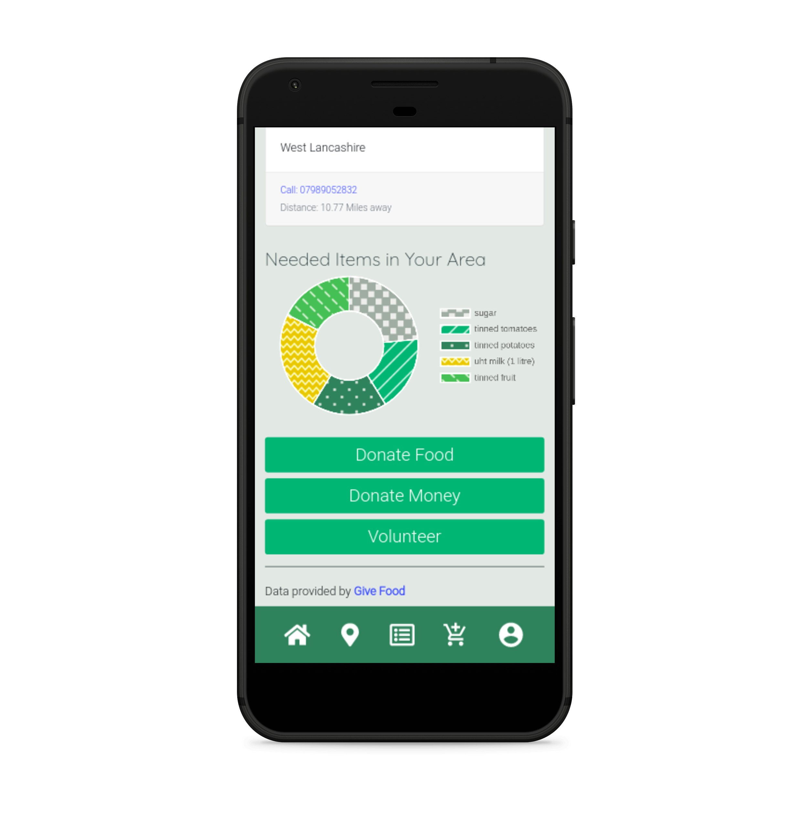

# Sharedbread - Easy Peasy Food Donations

An mobile-first web app designed to help alleviate the problems that UK food banks face. It’s main use is to acquire food donations to help support the burgeoning increases in food bank visits. Also a way for food banks to seek potential volunteers.

https://www.sharedbread.app/

## The Problem

* From April to September last year there was a 23% rise in food parcels being distributed from food banks to those in need (compared against the previous year).
* 94% of users face real destitution.
* 23% of users are homeless.
* Food donation fluctuate wildly and it’s difficult to maintain steady stocks.

Statistics from Trussel Trust

## Our Solution

* Our aim is to give the public a web application that’s easy to access where they can easily find their local food bank and a list of the items each food bank needs.
* Users can then add those items to a shopping list in the app - making it really simple to view what to purchase on their next shopping trip.
* There is also the option to add in other items that user might want to purchase as well.
* With gamification, we give users even more of a sense of achievement when they donate food!

    

## Live API

The data available within the app for local food banks and the foods they need is retrieved from a live API. https://givefood.org.uk/api/

## Tech Stack
* React
* Node Express API
* Serverless Lambda
* AWS RDS
* AWS Amplify
* AWS Cognito
* Google Maps API
* Chartjs

## Accessibility
Accessibilty was a key focus within the implementation after watching a lightning talk by Blue Prisms Head of UX Paul Wilshaw. 
* Used contrast checker tool to ensure icons and titles could be seen by those with colour blindess.
* Font sizes lifted to 18px.
* Target areas lifted to 48 x 48px.

## The Team
* [Hanan Abdimalik](https://github.com/hananabdimalik) - Fullstack development, database build and project management.
* [Bradley Nichol](https://github.com/BradNichol) - Fullstack development and DevOps.
* [Hannah Beadmore](https://github.com/HanaSoph) - Design, front-end development & marketing. 

## Future Developments
* Add functionality for food banks to ‘own’ their profile giving them extra flexibility.
* Include a ‘volunteering’ aspect to the app where food banks can send out push notifications for local volunteers.
* Add an option for users to donate money to their local food bank.
* Integrate with supermarkets to allow online shopping deliveries to local food banks.
* Add a news and updates section for news, stats & figures of what the food banks status is like or how many people rely of food bank.
* Do more with the data! For example: ‘You’ve donated 20 loaves of bread - that’s enough for about 180 sandwiches!’ or a more advanced badge could be: ‘Most donated items in your area!’

